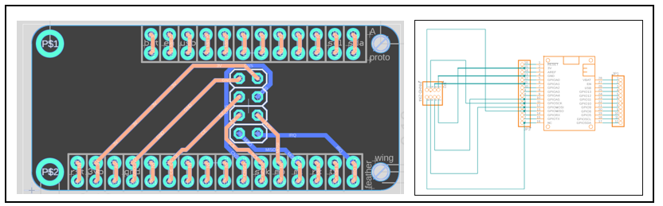

# RF24L01 receiver PCB

Files here are a passive adapter board to connect a generic NRF24L01 receiver board ([Amazon](https://www.amazon.com/HiLetgo%C2%AE-NRF24L01-Wireless-Transceiver-Compatible/dp/B00WG9HO6Q), [AliExpress](https://www.aliexpress.us/item/3256807093255629.html), ...) into FeatherWing form factor:

This directory contains Fusion 360 board (`.fbrd`) and schematics (`.fsch`) files, as well as a `.zip` archive containing Gerber files. The zip archive can be, for example, directly dropped into [JLCPCB](https://jlcpcb.com/), [OSH PARK](https://oshpark.com/) or many others.

